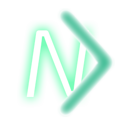
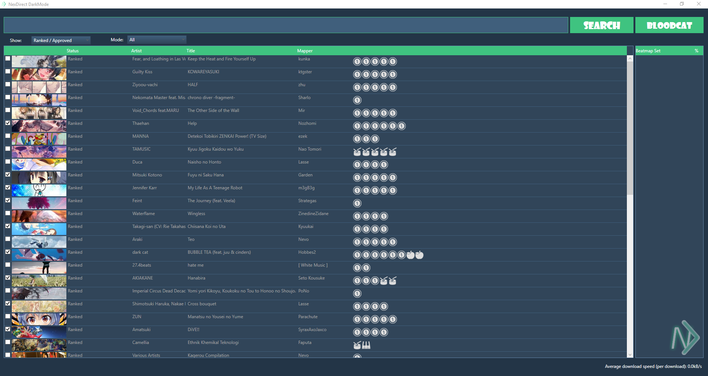
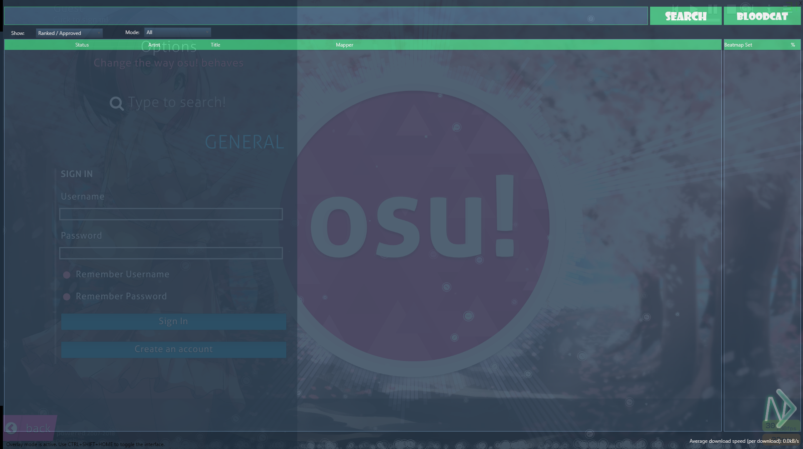

# NexDirect Dark Mode UI

*An alternative, open-source beatmap downloader for the game osu!, written in C#.*

 

## Usage
Original Release here [here in the releases section](https://github.com/nicholastay/NexDirect/releases).
NexDirect DarkMode Release here [herein the release section](https://github.com/Hixelite/NexDirect-Dark-Mode/releases/tag/NexDirect-Darkmode%2CNexDirect)

Downloading a beatmap is simple. Just type in the map you wish to download, click search and double click any map to start downloading it.

The settings menu can be accessed by clicking on the NexDirect logo in the bottom right of the interface.

## Previews

## Disclaimer
By using this software, you agree that any damages that it may cause, whether to your osu! account, your computer, whatever... I am not liable for. Basically functioning under the license below.

## License
Licensed under the zlib/libpng license. Full license text can be found in LICENSE.
